<picture>
  <source media="(prefers-color-scheme: dark)" srcset="assets/banner-dark.svg">
  <source media="(prefers-color-scheme: light)" srcset="assets/banner-light.svg">
  
</picture>

Hi, I'm Zübeyir, a software developer based in Istanbul.

I build web interfaces with React, Next.js and TypeScript, and reach for .NET or Python when the job needs a backend or a model behind it. What I care about most is how the decisions behind an interface end up feeling to the person using it.

Before Computer Engineering I spent some time in medical school. I was always the type to get stuck on details; I just changed the field. I graduated from Istanbul University-Cerrahpaşa.

### Experience

- **Baykar** · Frontend Developer Intern · Feb – Jun 2026 
  Real-time data with Server-Sent Events, PWA work and React Query in React + TypeScript.
- **Vakıfbank** · Internet Banking Infrastructure Intern · Aug – Sep 2025
- **Uyumsoft** · Software Engineering Intern · Jul – Aug 2025

### Stack

React · Next.js · TypeScript · .NET / C# · Python · SwiftUI · SQL

### Contact

[Portfolio](https://zubeyiralidemir.vercel.app) · [LinkedIn](https://www.linkedin.com/in/zubeyiralidemir/) · [Email](mailto:zubeyirad@gmail.com)
